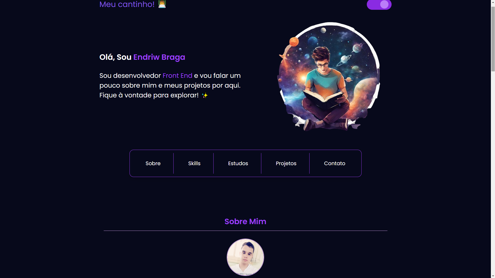

# MEU PORTFÓLIO

## Visão Geral
Este portfólio foi criado inicialmente para treinar JavaScript, mas gostei tanto do resultado que pretendo continuar aprimorando-o com novas melhorias.  
[🔗 Meu Portfólio] *https://meu-portfolio-ten-blond.vercel.app/*   

## Tecnologias Utilizadas  
🔶 HTML5  
🎨 CSS3 (futuramente SASS)  
⚡ JavaScript (ES6+)

## Estrutura de Pastas
Explicação sobre a organização dos arquivos no projeto:

📂 assets/ → Contém ícones e imagens utilizadas no front-end.  
📂 css/ → Contém o arquivo de estilização (style.css). No futuro, pretendo migrar para SASS.  
📂 js/ → Contém os arquivos responsáveis por tornar o projeto interativo.  

### Explicação detalhada do que cada modulo do JS faz.

📄 darkMode.js → Responsável por detectar a preferência de cor (modo claro/escuro) do sistema e permitir que o usuário altere manualmente a cor da página.  
📄 debounce.js → Implementação do padrão debounce para limitar a frequência de chamadas a funções, utilizado em várias partes do projeto.  
📄 messagesStudies.js → Responsável pela troca dinâmica das mensagens ao passar o mouse sobre os cards do plano de estudo.  
📄 smoothScroll.js → Responsável pela implementação de scroll suave ao selecionar um link no menu de navegação.  
📄 script.js → Arquivo principal que inicializa e configura várias funcionalidades interativas no projeto. Para mais detalhes, consulte o próprio arquivo.  
📄 slide.js → Responsável pelo carrossel de slides na seção "Meus Projetos", permitindo navegação interativa através dos ícones dos projetos, com versão mobile inclusa. Este carrossel foi inspirado em uma aula do curso de JavaScript da Origamid.  
📄 skillsAnimation.js → Responsável pela animação das skills, movendo-as para cima e depois retornando à sua posição original. Utiliza requestAnimationFrame(), uma funcionalidade nativa do JavaScript, para melhorar a performance da animação.  

### Principais Funcionalidades  
- Modo escuro automático e manual     
- Carrossel interativo de projetos    
- Mensagens dinâmicas nos cards de estudo 
- Scroll suave para melhor navegação
- Animação nas habilidades (Skills)

### Depoimento de Eu para Eu // Pode pular!
⭐ 1.0
- O arquivo skillsAnimation.js foi simplificado para manter a funcionalidade essencial, priorizando a manutenção e futuras modificações.

- Optei por usar módulos JavaScript (arquivos .js separados) e classes para estudar mais sobre Orientação a Objetos (OOP). Um exemplo disso é o arquivo slide.js, que utilizou conceitos de herança, encapsulamento e um pouco de abstração.  
⭐ 2.0  
- O arquivo skillsAnimation.js foi refatorado para incorporar mais conceitos de OOP, alinhando-se com o restante do projeto, que foi projetado para seguir boas práticas de programação orientada a objetos.

🏛️ Herança  
A classe SlideNav herda funcionalidades da classe Slide, reutilizando a lógica básica de navegação de slides e estendendo-a com funcionalidades específicas de navegação, como os controles de seta.

🏛️ Encapsulamento  
No arquivo Slide, detalhes sobre a movimentação, posição e transição dos slides são encapsulados dentro de métodos, evitando que o código externo manipule diretamente esses dados. O mesmo acontece no arquivo Animation: a manipulação do estado de cada cartão (cartoons) e a animação de seus movimentos são controladas internamente pelos métodos da classe SkillsAnimation.

🏛️ Abstração  
No arquivo Slide, a complexidade da navegação dos slides (movimento, transições e controle de estados) é abstraída através de métodos como moveSlide(), transition(), e changeSlide(). Já no arquivo Animation, o comportamento da animação (movimento dos cartões) é abstraído pelo método animate(), onde a lógica de transformação é escondida dentro de uma única função que controla o movimento dos cartões para cima e para baixo sem expor os detalhes do cálculo do movimento.

⚠️⚠️⚠️ Por algum motivo o target do botão não funciona no read.me, então melhor abrir em nova guia.  

